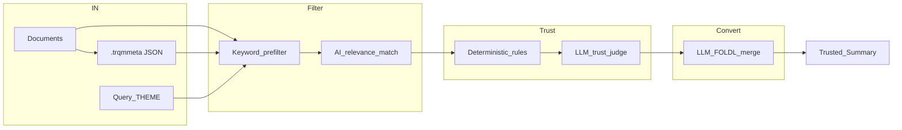

# TRQM Trust Pipeline Plan

## Focus (hackathon framing)

**Moment of doubt:** A payroll / HR consultant finds several documents for a customer question and cannot tell which answer applies to *this country / client / situation*, or why they should trust it.

**PoC promise:** Move from “I found something” to “here is the answer, the trust score, and the reasons (freshness, ownership, country fit, conflicts).”

**Stack:** Python 3.12+, FastAPI, SQLite + filesystem docs, OpenAI-compatible LLM client (`OPENAI_API_KEY` + `OPENAI_BASE_URL`). No vector DB in v1 — keyword/metadata prefilter + LLM ranking.

## Architecture



Aligned with the chalkboard: **FILTER** → **TRUST (map/filter)** → **CONVERT (FOLDL)** → **Summary**.

See also:

- [TRQMMETA.md](TRQMMETA.md) — sidecar metadata
- [TRUST_LAYER.md](TRUST_LAYER.md) — rules + scores + outputs
- [QUERY_PIPELINE.md](QUERY_PIPELINE.md) — step I/O and thresholds

## Repo layout

```
docs/                  # contracts and plan
schemas/               # JSON Schema for meta, trust, summary
src/trqm/              # pipeline implementation
data/docs/             # sample SD Worx-flavoured docs
tests/                 # schema + pipeline smoke tests
```

## Implementation order

1. Docs + JSON schemas (contracts)
2. Store + ingest + `.trqmmeta` generation
3. Keyword prefilter + relevance LLM
4. Trust rules engine + LLM judge
5. FOLDL convert → summary
6. FastAPI + sample docs + end-to-end demo
7. Conflict detection + expert hints from author meta

## Out of scope for PoC

Vector embeddings/RAG index, auth, Teams/email connectors, PDF OCR polish, multi-tenant prod hardening.
